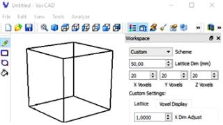
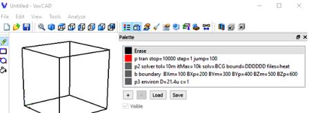
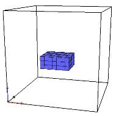
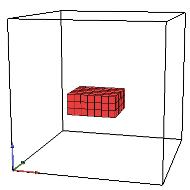
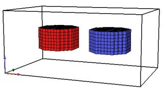
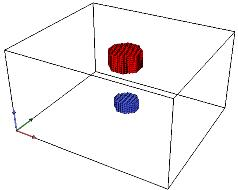
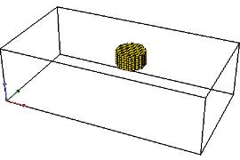
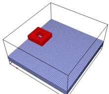
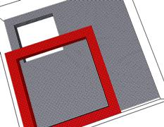
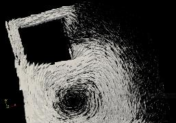

&emsp; The project is focused on multiphysical calculations of non-stationary processes described by a scalar or vector a  partial differential equation. A numerical calculation of equations of the type is proposed:  

 $$ D \left( \frac {\partial^2 U}{\partial x^2} + \frac{\partial^2 U}{\partial y^2} + \frac{\partial^2 U}{\partial z^2} \right) - C  \left( \frac {\partial U}{\partial t} + V_x \frac {\partial U}{\partial x} + V_y \frac{\partial U}{\partial y} + V_z \frac{\partial U}{\partial z} \right) = -F $$  
 
where:  
&emsp; **_U_** is a scalar or vector; **_D_**, **_C_** – physical domain parameters (constants).  
&emsp; **_D_** can be called the diffusion coefficient, it can correspond to thermal, electrical, magnetic conductivity, etc. **_C_** can be called the dynamic coefficient, it can correspond to thermal, electrical capacity, etc.  **_Vx_**, **_Vy_**, **_Vz_** - constant velocities in the **_x_**, _**y**_, _**z**_ directions, correspond to the movement of the physical domain; **_F_** – vector or scalar field of external sources.  
&emsp; Dirichlet, Neumann (zero only), and Robin (open boundaries only) boundary conditions are used. The initial conditions are defined only for the scalar field. For external field sources, movement in three-dimensional space is possible (in Lagrangian coordinates).  
&emsp; The cell method and an equivalent nodal circuit are used to construct a calculation algorithm. To obtain the parameters of the circuit, a finite-difference PDE approximation was used.Two types of finite-difference approximation were used: for the Successive Over-Relaxation method (**SOR**, matrix-free approximation) and for the Biconjugate Gradient Stabilized with rewrite method (**BiCGSTABwr**, a sparse matrix is ​​used).  
&emsp; An important feature of the approach used:: _no need for a mesh generator_. Difference equations are "placed” on already prepared cells.  This is similar to the use of a _breadboard_ - plastic board with many ordered holes inside. These holes allow electronic components to be easily inserted into the prototype, making it easier to assemble and test early versions of the design.  
&emsp; In this sense, this project serves the purpose of a **preliminary** study of various tasks associated with field calculations. These tasks include: generating initial data, implementing difference equations, boundary conditions, storage forms for matrices and vectors, solving systems of equations, implementing code, displaying results, etc. For example, one of tasks was to determine the influence of moving sources on the field distribution.  
&emsp; This project uses the **VoxCad** editor, which allows you to enter arbitrary text data about the characteristics of the elements included in the 3D image, which became the determining factor in its selection. The project is a continuation of the **convert_VoxCad_data** project. (<https://github.com/JNSresearcher/convert_VoxCad_data>)  for converting the **VoxCad** data format into text data for subsequent mathematical calculations.  

### Required Software 
Assembly and testing were done in **Windows**.  
- **VoxCad**  (download: <https://sourceforge.net/projects/voxcad/files/VoxCAD1000-x64.msi/download>) (there is a version for  **Linux**: <https://sourceforge.net/projects/voxcad/files/VoxCad0992.tar.gz/download>);   
- **gfortran** or **ifort** (Fortran2018);   
- **Python** (optional) - for data decompression ( I used  **Python** as part of **Anaconda**, which includes the **zlib** library for **Python**). 					If the **vxc** file contains data in uncompressed ASCII format, then there is no need for **Python**. For example, on can use an analogue of **Voxcraft-viz** with better 3D graphics (<https://github.com/voxcraft/voxcraft-viz>) and which stores data in ASCII by default;  
- **make** - for build;  
- **ParaView** - to display calculation results in files in **vtk** format (download: <https://www.paraview.org/>);  


### Repository Structure
Directory **/src**:  
- **fields_3d.f90**  - main program;   
- **m_vxc2data.f90** - module for sharing data obtained when converting data from a **VoxCad** file;  
- **vxc2data.f90** - program for converting data from a **VoxCad** file;   
- **solvers.f90** - linear equation solver using SOR or BiCGstab methods (discussed in detail in my project <https://github.com/JNSresearcher/SOLVERS_BCGSTAB_GMRES>);  
- **utilites.f90** - contains routines for different tasks (convert a string to an array of words, convert to upper case,representation of a 3D image in **vtk**, converting a word to a number;  
- **m_fparser.f90** - parser for calculating functions specified in the lines of a **VoxCad** file. Adapted from source files, available from <http://fparser.sourceforge.net>;   
- **uncompress_zlib.py** - for create a temporary file with converted uncompressed data into ACSII for later processing;  
-  **Makefile** - creating an executable using **make**.  

&emsp;Files in **VoxCad** format with examples of tasks for calculations in the time domain:  
- **scal_bndD.vxc** - scalar field: without external sources and with Dirichlet boundary conditions;  
- **scal_U_bndD.vxc** - scalar field: without external sources and with Dirichlet boundary conditions and given values ​​of the scalar field in some domains;  
- **scal_U0_Vex_bndD.vxc**- scalar field: without external sources, with Dirichlet boundary conditions, initial potential distribution and motion of the environment;  
- **scal_bndA_2src.vxc**- scalar field: with two external sources and open boundaries;  
- **scal_move_out.vxc** - scalar field: with a moving source, test for going beyond the boundaries of the computational domain;  
- **scal_move_across.vxc** - scalar field: with two moving sources, test for intersection of trajectories;  
- **vec_eddy_src_move.vxc** - vector field with a moving source (coil with alternating current) above a stationary conducting region (in Lagrangian coordinates);  
- **vec_eddy_Vex.vxc** - vector field with a stationary source (coil with alternating current) above the conducting region and a constant speed of movement of the conducting region (in Eulerian coordinates).  

### Build  
&emsp; To build the  executable file **fields_3d.exe**, should be configure the **makefile**. It is possible to build with **gfortran** or **ifort**. To configure, on need to comment/uncomment the top lines, for example, for  **gfortran**:   
```
          F90=gfortran  
        # F90=ifort
```  
&emsp; Type **make** at the command prompt and run.  

### Launch of calculation  
&emsp; At first, on need to save the data, for example **example.vxc**, to a working file named **in.vxc** in the same directory as the **fields_3d.exe** executable.  
Next run the executable file: **fields_3d.exe**. As a result, output files will be created: with extensions  **vtk**. 

### Output files 

&emsp; The calculation results are written to files with the extension **vtk**, which are located in the directory **/out**. If there are external sources in the calculations, then two sets of files are generated:  
&emsp; **field_file\*.vtk** - for displaying a 3D field and **src_file\*.vtk** - for displaying sources on an unstructured grid. The number of files corresponds to the number of calculated points in time. 

## Examples
&emsp; Let's look at the rules for preparing initial data using examples. All example files are located in the **/src** folder.  
Important note - all numerical values ​​in the examples are of a test nature and are not related to the calculation of a specific physical system.   
### Scalar fields
&emsp; &emsp; &emsp; **Example 1, file _scal_bndD.vxc_**  
&emsp; The simplest example of solving the Laplace equation  with Dirichlet boundary conditions, without external sources.  
&emsp; Below is a screenshot of  **Workspace** tab of the  **VoxCad** editor , where the area size is set to 20x20x20 and the grid step to 50mm. Next to it is the **Palette** tab with the entered data for the calculation:   

| Workspace tab | Palette tab | 
|  :-:          |:-:          | 
|&emsp; |&emsp;  |

 Text entered on the **Palette** tab:  
```
            p tran stop=10000 step=1 jump=100
            p2 solver tol=10m itMax=10k solv=BCG bound=DDDDDD files=heat
            b boundary  BXm=100 BXp=200 BYm=300 BYp=400 BZm=500 BZp=600 
            p3 environ D=21.4u c=1
```
   Here are the rules for entering text.   
   
&emsp; General notes: All lines consist of words separated by spaces or the "=” sign. During processing, the "=” sign is replaced with a space.  All characters are converted to uppercase.  The 1st word is the line name, this word is mandatory, although it is not used yet.  
Here are the meanings of the keywords for each line of this example. The keywords in the description below are given in quotation marks, but on the **Palette** tab they must be without quotation marks.    

*  **p** string. After the keyword "tran" - the parameters of the transient process in seconds are set:  
&emsp; &emsp; The keyword "stop" is the time of the transient process;  
&emsp; &emsp; The keyword  "step" - is the time step;  
&emsp; &emsp; The keyword  "jump" -  is the time jump for outputting the results to a file;  
* **p2** string. After the keyword "solver" - - the solver parameters are set:  
&emsp; &emsp; The keyword  "tol" - convergence criterion. This is a variant of the value with a prefix: 10m, i.e. 10е-3. (More about prefixes <https://github.com/JNSresearcher/convert_prefix>) ;  
&emsp; &emsp; The keyword  "itMax" - maximum number of iterations ;  
&emsp; &emsp; The keyword  "solv" - name of methods: "BCG" or "SOR" ;  
&emsp; &emsp; The keyword  "bound" - boundary conditions on 6 faces: **N** - _Neumann_, **D** - _Dirichlet_, **A** - _Absorption_ conditions;  
* **b** string. After the keyword "boundary" - the values ​​of the Dirichlet boundary conditions are specified keywords: "BXm", "BXp", "BYm", "BYp", "BZm", "BZp";  
* **p3** string. After the keyword "environ" - the parameters of the environment are specified:  
&emsp; &emsp; Keyword "D" - diffusion coefficient, the coefficient before the second derivatives (see PDE). In this case, it is D=21.4u, i.e. D=21.4e-6;  
&emsp; &emsp; The keyword "C" - is the inertial coefficient, the coefficient before the first derivatives (see PDE);  

&emsp; &emsp; Screenshot of calculation result in Parawiev:  
  
   

***
&emsp; &emsp; &emsp; **Example 2, file _scal_U_bndD.vxc_**  
Example of solution without external sources and with Dirichlet boundary conditions and given values ​​of the scalar field in some domains.  
The size of the computational area is 20x20x20, the grid step is 50mm. Inside there is an domain with a constant value of the scalar field.  
  
View of the workspace and calculation results:  
 &emsp; &emsp;  

Text entered on the  **Palette** tab:  
```
            Uconst D=41.8u Ubnd=-100
            p tran stop=1700 step=0.02 jump=17
            p2 solver tol=10m itMax=10k solv=bcg bound=DDDDDD files=heat
            b boundary  BXm=100 BXp=200 BYm=300 BYp=400 BZm=500 BZp=600 
            p3 environ D=41.8u c=1
```  
   Let us give some explanations   
&emsp; Unlike the previous example, here a domain is entered into the calculation field. General rule: if domains are entered into the calculation field, they are entered first, then the lines with parameters. These lines should not be displayed in the calculation field.   

* **Uconst**  string.  After the keyword "D" , the value of the "diffusion" parameter is written. Here, it is a number with the prefix 41.8u, i.e. 41.8e-6. Then, after the keyword  "Ubnd", the value of the scalar field is given.  Here, it is -100. This value will remain unchanged during the entire calculation.  
* The remaining lines are the same as in the previous example, except for the "diffusion" parameter of the environment.  

***
&emsp; &emsp; &emsp; **Example 3, file _scal_U0_Vex_bndD.vxc_**  
Example of calculating a scalar field with Dirichlet boundary conditions, initial conditions in a certain domain and a moving environment.  
The size of the calculation area is 20x20x20, the grid step is 50mm.   

View of the workspace and calculation results:  

 &emsp; &emsp;    

Text entered on the **Palette** tab:  
```
            u0  D=41.8u c=50 VEx='4*dx*Nx/time' U0=600
            p tran stop=1700 step=0.02 jump=17
            p2 solver tol=10m itMax=10k solv=BCG bound=DDDDDD files=heat
            b boundary  BXm=100 BXp=200 BYm=300 BYp=400 BZm=500 BZp=600 
            p3 environ D=41.8u c=1  VEx='4*dx*Nx/time'
```
Let us give some explanations.   
&emsp; Unlike the previous example, the initial value of the scalar field is specified in the domain. This value changes during the calculation. In addition, the motion of the environment in this domain is specified.  

* **u0**  string. First, the "diffusion" parameter is entered after the keyword "D". Then, after the keyword "c", the inertial parameter. Next, there is the keyword "VEx" - the velocity of the environment in the **x** direction (you can also specify the velocities "VEy”, "VEz”). Here, the velocity value is specified through an expression that must be in quotation marks. The expression contains numbers and constants in the form of symbols. There must be no prefixes in the numbers. The following constants can be used as symbols:  
&emsp; &emsp; **dx**, **dy**, **dz** - grid steps along **x,y,z**.  
&emsp; &emsp; **Nx**, **Ny**, **Nz** - grid size along **x,y,z**.  
&emsp; &emsp; **time**, **dt** - transient time and time step.  
&emsp; &emsp; **pi, e, mu0, e0** : $\pi=3.1415... , \epsilon=2.7182..., \mu_0=0.12566...10^{-5}, \epsilon_0=0.88541...10^{-11}$, respectively.  
In this case **VEx='4\*dx\*Nx/time'** = $4*50*10^{-3}*20/1700 = 0.002352 m/s$. 
With this speed, the environment will pass 4 times the length of the calculated region during the transient process (a similar speed is entered for the environment in line **p3**).  The line ends with a parameter with the keyword "U0” - the initial value of the scalar field in this domain. In our case, this is 600.  
* The remaining lines are the same as in the previous example, except that the speed of the environment  **VEx='4\*dx\*Nx/time'** is entered ..  

***
&emsp; &emsp; &emsp; **Example 4, file _scal_bndA_2src.vxc_**  
Example of calculating a scalar field with open boundaries and two sources of an alternating scalar field of opposite polarity.  
The size of the computational domain is 44x26x20, the grid step is 2mm.    
&emsp; Some comments on the use of boundary conditions of the "open boundaries” type here (other names are possible: "non-reflecting boundary conditions”, "absorbing boundary conditions”). The goal is to implement zero field values ​​at "infinity”, but at the same time limit the computational space to the domains under study. An approximate implementation of "open boundaries” is used here. Its brief description. Robin boundary condition in general form:  **a\*U + b\*dU/dx  = f**, where  **a,b**  are constants, **f** is a function. We assume that **f=0**. Then the boundary condition can be written as:  **-b\*dU/dx = a\*(U - U∞), U∞** -  is the field value at infinity. In our case  **U∞ = 0**. In finite differences on the left boundary: **-b\*(Un+1 - Un) = -a\*dx\* Un+1** or:  **Un = (1 - a\*dx/b)\*Un+1**. Similarly, on the right boundary: **Un = (1 - a\*dx/b)\*Un-1**.  In calculations, _regardless_ of  **a,b,dx,dy,dz**  the expression in brackets is taken to be equal to  **0.9**, for all boundaries. That is, finally, for the boundary  **Xmin: Un = 0.9\*Un+1** ;  For the boundary **Xmax: Un = 0.9\*Un-1** . Similarly for  **Ymin, Ymax, Zmin, Zmax**. Studies have shown that for the correct implementation of open boundaries, the sources of the scalar field should be located no closer than 5-6 cells from the boundary.  

View of the workspace and calculation results (the gradient vectors of the scalar field are shown):  
  
  &emsp; &emsp;    
Text entered on the  **Palette** tab:  
```
            d1 D=1 SRC0 = Fp
            d2 D=1 SRC0 = Fm
            p1  tran  stop=200m step=1m jump=2m
            p2 solver tol=1m ITmax=1k solv=SOR bound=AAAAAA files=SCAL
            f2 func Fp = a*(1-sind(360*f*t)) a=5 f=10 t=t
            f3 func Fm = a*(1-sin(p*f*t)) a=-5 p='2*pi' f=10 t=t
```
Let us give some explanations.   

* **d1**  string. The domain is drawn in the workspace. The domain parameter "D” is equal to 1. Next comes the keyword "SRC0”. It designates that a scalar field source is active in the domain. The name of the function for calculating the source is specified after the "=” sign. In this case, it is **Fp**. The description of the functions is specified in the last lines.  
* **d2**  string.  Similarly, the 2nd domain is drawn in the workspace, the line specifies the mandatory parameter "D”. After the keyword "SRC0” is the function name **Fm**.  
* **p1**  string. The calculation time parameters are entered. The rules were considered in example 1.  
* **p2**  string. The solver parameters are entered. The rules were considered in example 1, except for the boundary conditions on 6 faces. Here
 **bound=AAAAAA**  is specified. That is, open boundaries are set on all 6 boundary faces. The same line sets the name for the output files: **SCAL**.  
* **f2**  string. After the keyword "func”, the description of the function  **Fp** is entered: after the "=” sign, the symbolic expression of the function is written without spaces, then the values ​​of the arguments. The symbolic expression: **a\*(1-sind(360\*f\*t))** has 3 arguments  **a**, **f**, **t**. Numeric values ​​​​are assigned to the arguments immediately after the function. The keyword "t” is assigned to the argument **t** присваивается ключевое слово "t". During the calculation, the calculated time will be assigned to this argument. Note that the **sind** function is available only in **Fortran2018**, the argument is specified in degrees.   
* **f3**  string. After the keyword "func”, the description of the function  **Fm** is entered. The rules are the same, except for the**sin**, function , which uses 4 arguments. The argument **p**  is calculated through a quoted expression using the symbolic constant  **pi** (see example 1).  

***
&emsp; &emsp; &emsp; **Example 5, file _scal_move_across.vxc_**   
An example of calculating a scalar field with two field sources of opposite polarity moving along different trajectories in space. Here, the situation with the intersection of trajectories was tested. One source moves in a plane along the Archimedes spiral, the second source moves along a helical line upward (and partially extends beyond the workspace).  
The size of the calculation area is 75x65x40, the grid step is 2mm.  

View of the workspace and calculation results (the gradient vectors of the scalar field are shown):   

   &emsp; &emsp;   
Text entered on  **Palette** tab:  
```
            sM1 D=1 SRC0 = Fm Vsx=Vm1x Vsy=Vm1y Vsz=Vm1z
            sP1 D=1 SRC0 =Fp Vsx=Vm2x Vsy=Vm2y 
            p1  tran stop=12.56 step=0.0628
            p2 solver tol=1m ITmax=1k solv=SOR bound=NNNNNN files=SCAL
            f1 func Fp=a*cos(t/100) a=5  t=t 
            f2 func Fm=a*cos(t/100) a=-5   t=t 
            m1 func Vm1x =a*cos(t) a='dX*Nx/6'  t=t 
            m2 func Vm1y =a*sin(t) a='-dY*Ny/6' t=t 
            m3 func Vm1z = az az='0.8*dz*Nz/time'
            m4 func Vm2x =a*cos(t)-a*t*sin(t) a='dX*Nx/(3*12)'  t=t 
            m5 func Vm2y =a*sin(t)+a*t*cos(t) a='dY*Ny/(3*15)'  t=t
```
Let us give some explanations.   

* **sM1**  string. The parameter **D=1**  and the name of the function for calculating the scalar field source are set: **Fm**.Next come the keywords for references to the names of the functions for calculating the source motion velocities. The keyword "Vsx” is for the function for calculating the source velocity by the **x** coordinate .  In this case, this is the function name **Vm1x**.   Accordingly, "Vsy", "Vsz"  are for references to the functions for calculating the velocities by **y** and **z**. These will be the functions **Vm1y** and **Vm1z**.  
* **sP1**  string. The parameter **D=1** and the name of the function for calculating the scalar field source are set:  **Fp**.The source will move with velocities by the **x** and **y**. The keywords "Vsx” and "Vsy” refer to the functions **Vm2x** and **Vm2y**.  
* **p1** and **p2**  strings set the time intervals, solver parameters and the name of the output files.  
* **f1** and **f2**   strings describe periodic functions of time for external sources of the scalar field as cosines with a low frequency. The amplitude remains practically constant.   
* **m1**, **m2**, **m3**   strings describe the functions for calculating the trajectory of the source specified in the line **sM1**. The trajectory is specified parametrically as a function of time for velocities along all three coordinates. In this case, it is a helical line. The parametric definition of a helical line for the coordinates is known:  
```
                x = a*sin(t)  
                y = b*cos(t)  
                z = с*t
```
 After differentiation with respect to time, we obtain expressions for the velocities:  
```
                dx/dt =  a*cos(t)  
                dy/dt = -b*sin(t)  
                dz/dt =  с
```
The values ​​of the coefficients are selected such that the trajectory is within the calculation domain:  
```
            a = dX*Nx/6,  b = dY*Ny/6, c = 0.8*dz*Nz/time
```
The initial coordinates correspond to the value of the parameter  **t=0** and the initial coordinates of the domain placement.  

* **m4**, **m5**   strings describe the functions for calculating the trajectory of the source specified in the line  **sP1**.  In this case, this is the Archimedes spiral located in the plane perpendicular to the **z** axis. The principles for obtaining functions for velocities are the same as for the considered case of a helical line.   

***
&emsp; &emsp; &emsp; **Example 6, file _scal_move_out.vxc_**  
Example of calculating a scalar field with one field source moving along an ellipse in a plane perpendicular to **z**. Here, the situation with going beyond the boundaries of the calculation domain with Dirichlet boundary conditions was tested.  
The size of the calculation domain is 76x40x22, the grid step is 2mm.

View of the workspace and calculation results (the gradient vectors of the scalar field are shown):  

  &emsp; &emsp;       
Text entered on the **Palette** tab:  
```
            M1 D=1 SRC0 = F0 Vsx=Vmx Vsy=Vmy 
            p1  tran stop=12.56 step=0.0628
            p2 solver tol=1m ITmax=1k solv=SOR bound=DDDDDD files=SCAL
            f2 func F0 = 5 
            m1 func Vmx =a*cos(t) a='dX*Nx/2'  t=t 
            m2 func Vmy =a*sin(t) a='-dY*Ny/3' t=t 
```
The previous examples describe the purposes of all the keywords that appear in this example. The only peculiarity is that in line  **f2** the function is defined without arguments, as a constant.  

***
### Vector fields
&emsp; &emsp; &emsp; **Example 7, file _vec_eddy_src_mov.vxc_**  
Example of calculating the vector field created by a moving coil with alternating current over a conducting region in which eddy currents are induced. The equations are solved relative to the vector potential. The trajectory of the coil corresponds to the Lissajous figure in the plane perpendicular to the **z** axis.   
The size of the calculation region is 52x55x26, the grid step is 5mm.    

View of the workspace and calculation results (vectors of current in the coil and eddy currents in the plate are shown):  

  &emsp; &emsp;   
Text entered on the  **Palette** tab:  
```
            axp D=1 SRCx=Fp  Vsx=Vmx  Vsy= Vmy
            axm D=1 SRCx=Fm  Vsx=Vmx  Vsy= Vmy
            ayp D=1 SRCy=Fp    Vsx=Vmx  Vsy= Vmy
            aym D=1 SRCy =Fm   Vsx=Vmx  Vsy= Vmy
            plast D=1 C='mu0*37e6'
            p1 param  tran stop=80m step=0.2m
            p2 solver tol=10m itmax=10000 solv=sor bound=AAAAAA  files=vec
            f1 func Fp=a*cos(p2*f*t) a=50 p2='2*pi' f=50 t=t 
            f2 func Fm=a*cos(p2*f*t) a=-50 p2='2*pi' f=50 t=t 
            m1 func Vmx=2*a*f*sin(p2*f*t) a='dX*Nx' p2='2*pi' f=25 t=t 
            m2 func Vmy=2*a*f*cos(p2*f*t) a='-dY*Ny' p2='2*pi' f=50 t=t 
```
Let us give some explanations.  

* **axp**  string. This is the part of the coil, along the **x** axis , in which the current will flow in the positive direction. The vector source in the **x** direction in the domain is specified by the keyword "SRCx” and a reference to the function **Fp**.   Next, after the keywords "Vsx” and "Vsy” there are references to the functions that calculate the speeds of this part of the coil: **Vmx** and **Vmy**. For other parts of the coil there should be the same functions.  
* **axm**  string. This is the part of the coil, along the **x**, axis , in which the current will flow in the negative direction. The vector source in the **x** direction in the domain is specified by the keyword "SRCx” and a reference to another function: **Fm**.   
* **ayp** and **aym**  strings . Similarly, they specify the vector current source for parts of the coil in the **y** direction . The vector source in the **y** direction in the domain is specified by the keyword "SRCy” and a reference to the functions  **Fp** and **Fm**.  
&emsp; Note the proximity of the source to the boundary. As calculations have shown, the magnetic field at the coil level is distorted, but this distortion seems to have little effect on the eddy currents.  
* **plast**  string. The domain corresponds to an aluminum plate with  conductivity **$\sigma=37\cdot10^6$**. The dinamic coefficient "c" is calculated using the formula **$\mu_0\cdot\sigma$**.   
* **p1** and **p2**   strings set the time intervals, solver parameters and the name of the output files.  
* **f1** **f2**   strings describe the functions of changing the currents in the coils in the positive and negative directions, respectively. The amplitudes are set to 50. This is a conditional figure. Of course, it corresponds to some current in the coil. But which one exactly is not considered in this example.   
* **m1**, **m2**   strings describe the parametric functions for calculating the coil speed along **x** and **y** axis. Example 5 contains a description for obtaining similar functions for speed.  
   
***
&emsp; &emsp; &emsp; **Example 8, file _vec_eddy_Vex.vxc_**  
Example of calculating the vector field created by a stationary coil with alternating current over a conducting region that moves in the **x** axis direction (in Euler coordinates). The equations are solved relative to the vector potential.  
The size of the calculation region is 52x55x26, the grid step is 5mm.   

View of the workspace and calculation results (vectors of current in the coil and eddy currents in the plate are shown):  
   
   &emsp; &emsp;   
Text entered on the **Palette** tab :  

```
            axp D=1 SRCx=Fp 
            axm D=1 SRCx=Fm 
            ayp D=1 SRCy=Fp 
            aym D=1 SRCy =Fm  
            plast D=1 C='mu0*37e6' Vex='mu0*37e6*15'
            p1 param  tran stop=80m step=1m
            p2 solver tol=10m itmax=10000 solv=BCG bound=AAAAAA files=vec
            f1 func Fp=a*cos(p2*f*t) a=50 p2='2*pi' f=50 t=t  
            f2 func Fm=a*cos(p2*f*t) a=-50 p2='2*pi' f=50 t=t 
```
Let us give some explanations.  

* **axp**,**axm**,**ayp**,**aym**   strings the parts of the coil in the **x** and **y** direction are defined and references to the functions for calculating the current in the coil are given, similar to the previous example.    
* **plast**   string as in the previous example corresponds to an aluminum plate, but differs in that a constant speed of movement of the plate in the **x** direction is given (for the environment only a constant speed can be given). This speed is calculated in accordance with the expression **$\mu_0\cdot\sigma\cdot V_x$**. As can be seen from the string, the speed of the plate is 15 m/s.   
* **p1** and **p2**   strings set the time intervals, solver parameters and the name of the output files.   
* **f1** **f2**   strings describe the functions of changing the currents in the coils in the positive and negative directions, respectively.  

&emsp;  It is important to note that the example does not work with the **SOR** solver. Perhaps the solver used does not cope well with the asymmetry of the difference equations caused by the plate speed. Nevertheless, a solution can be obtained, but only at speeds less than 3.5 m/s.  

***
### Preliminary studies
&emsp; This project does not provide for the interaction of scalar and vector fields. For example, when calculating eddy currents in domains with limited dimensions and holes, a joint calculation of the field of the scalar electric potential and field of the vector magnetic potential is required. Below is a screen shot of the preliminary results of such a joint calculation when solving the problem of eddy current flow around a hole.  

 &emsp;   
 
&emsp; View of the workspace and calculation results (vectors of eddy currents in the plate are shown). The size of the calculation region is 94x94x24, the grid step is 3.33 mm.  
 
***
  
  